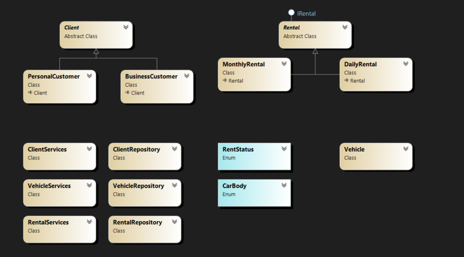

# 🚗 EasyRent

EasyRent is a console-based vehicle rental system developed in **C# and .NET** as a learning project.

The project was created to practice Object-Oriented Programming concepts and later evolved to include **SQL Server persistence with ADO.NET**, separating the application into models, services, and repositories.

> This is an educational project developed as part of my learning journey in C#/.NET, SQL, databases, and Git.

## 📌 Features

### 👤 Client Management

- Register personal and business customers
- Update customer email
- Delete customers
- Search customers by email
- Search customers using partial email matching
- List registered customers
- Validate CPF
- Validate minimum age for personal customers

### 🚘 Vehicle Management

- Register vehicles
- Update daily rates
- Delete vehicles
- Search vehicles by license plate
- List registered vehicles
- Update vehicle mileage after a rental

### 📄 Rental Management

- Create daily and monthly rentals
- Complete rentals
- Cancel reservations
- List rentals by customer
- Track rental status
- Add optional insurance to daily rentals
- Calculate rental prices, discounts, and mileage penalties

## 💰 Business Rules

The application includes different rules depending on the rental type.

### Daily Rental

- Optional insurance costs **$50.00 per day**
- Mileage allowance is **100 km per rental day**
- Excess mileage costs **$1.20 per kilometer**
- Personal customers registered as rideshare drivers receive a **10% discount**

### Monthly Rental

- Monthly rentals receive a **15% discount on the daily rate**
- Extended contracts receive an additional **5% discount**
- Personal customers registered as rideshare drivers receive a **10% discount**

### General Rules

- Personal customers must be at least **18 years old**
- Rental duration must be greater than zero
- Final vehicle mileage cannot be lower than the current mileage
- Rentals can have the following statuses:
  - `Open`
  - `Finished`
  - `Canceled`

## 🛠️ Technologies

- **C#**
- **.NET 10**
- **SQL Server**
- **ADO.NET**
- **Microsoft.Data.SqlClient**
- **Git & GitHub**

## 🧠 Concepts Practiced

This project was used to practice and reinforce:

- Object-Oriented Programming
- Classes and objects
- Encapsulation
- Inheritance
- Polymorphism
- Abstract classes
- Interfaces
- Constructors and properties
- Enums
- Collections
- LINQ
- Nullable reference types
- Input validation
- Exception handling
- SQL CRUD operations
- Primary and foreign keys
- Relational database modeling
- Parameterized SQL queries
- Mapping database records to C# objects
- Repository and Service separation
- Git branches, commits, merges, push and pull

## 🏗️ Project Structure

```text
EasyRent/
│
├── Interfaces/
│   └── IRental.cs
│
├── Models/
│   ├── Client.cs
│   ├── PersonalCustomer.cs
│   ├── BusinessCustomer.cs
│   ├── Vehicle.cs
│   ├── Rental.cs
│   ├── DailyRental.cs
│   ├── MonthlyRental.cs
│   └── Enums.cs
│
├── Repositories/
│   ├── ClientRepository.cs
│   ├── VehicleRepository.cs
│   └── RentalRepository.cs
│
├── Services/
│   ├── ClientServices.cs
│   ├── VehicleServices.cs
│   └── RentalServices.cs
│
└── Program.cs
```

## 🧩 Class Diagram

The diagram below provides an overview of the main classes, inheritance relationships, interfaces, services, repositories, and enums used in the project.



### Models

Represent the main entities and business concepts of the application.

`Client` and `Rental` are abstract classes specialized through inheritance:

```text
Client
├── PersonalCustomer
└── BusinessCustomer

Rental
├── DailyRental
└── MonthlyRental
```

### Repositories

Handle communication with SQL Server using ADO.NET and parameterized SQL commands.

### Services

Coordinate application operations between the console interface, domain objects, and repositories.

### Program

Contains the console menus and controls the main application flow.

## 🗄️ Database

EasyRent uses **SQL Server** for data persistence.

The application stores data for:

- Clients
- Personal customers
- Business customers
- Vehicles
- Daily rentals
- Monthly rentals

The repositories use `Microsoft.Data.SqlClient` to execute SQL commands and map database records back into C# objects.

> The database and connection string must be configured locally before running the application.

## ▶️ Running the Project

### Requirements

- .NET 10 SDK
- SQL Server
- Visual Studio, Visual Studio Code, or another C# compatible IDE

Clone the repository:

```bash
git clone https://github.com/paulohenrique3140/EasyRent.git
```

Enter the project directory:

```bash
cd EasyRent/EasyRent
```

Restore the dependencies:

```bash
dotnet restore
```

Configure the SQL Server connection string according to your local environment and run:

```bash
dotnet run
```

## 🎯 Project Purpose

EasyRent was developed exclusively for **educational purposes**.

The goal was not to build a production-ready rental system, but to apply concepts studied during my C#/.NET learning path in a single project.

The project started as a simple console application focused on OOP and gradually evolved to include inheritance, polymorphism, interfaces, SQL Server persistence, ADO.NET, repositories, services, and Git workflows.

This repository represents a stage of my development journey and will serve as a reference for comparing my progress in future projects.

---

Developed as part of my **C#/.NET learning journey**. 🚀
